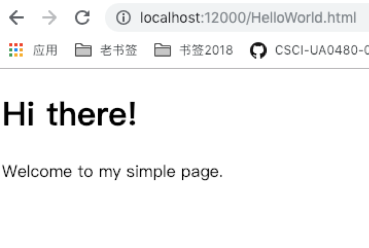
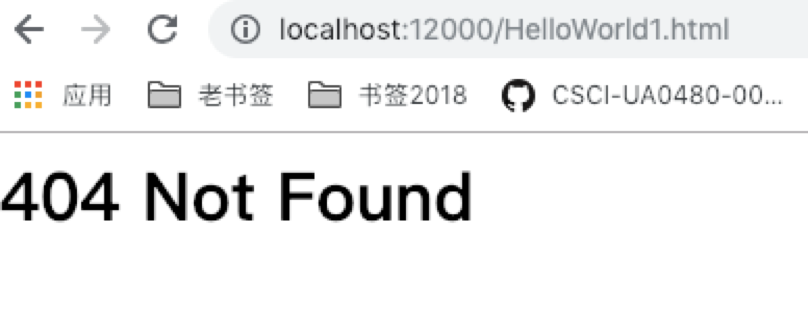
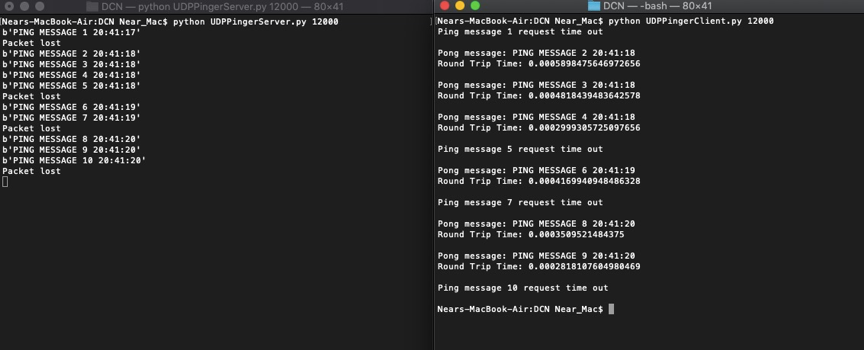

# Web-Server-and-UDP-Pinger

## Web Server

I use the skeleton code from the companion website (www.pearsonhighered.com/cs-resouces). My server will create a connection socket, then receive the HTTP request from this connection, then parse the request, then get the requested file, then create a HTTP response message of the file with the header line, finally send the response to the browser. If the requested file is not found, my server will return a “404 Not Found” error message. My server mainly implements two features: show the file found and show the not found message.

Demo:
 

I make a HelloWorld.html file in the same directory. The browser shows it below.

But I do not have a file named HelloWorld1.html, the browser shows it below.

## UDP pinger

The server code is completely got from the companion website (www.pearsonhighered.com/cs-resouces). I imitate the server code to implement my own client code. My UDP Pinger program client part will send a simple ping message to the server part to receive a corresponding pong message back. Then, my program will determine the delay between when the client sent the ping message and received the pong message. The delay time is named the Round Trip Time (RTT). And I assume the packet lost rate is 40% in the server, because UDP is an unreliable protocol. The client will wait up to one second for a reply, and print a lost message if it does not get a reply in one second. My program mainly implements two features: record the RTT with current time and show the packet lost.

Demo:

The left terminal window shows that I run the server code, and it constantly run for waiting the ping message from the client. And The right terminal window shows the information in the client code. We can see sometimes packet lost happens.

